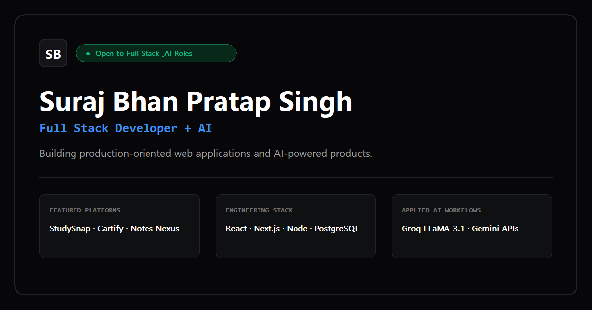
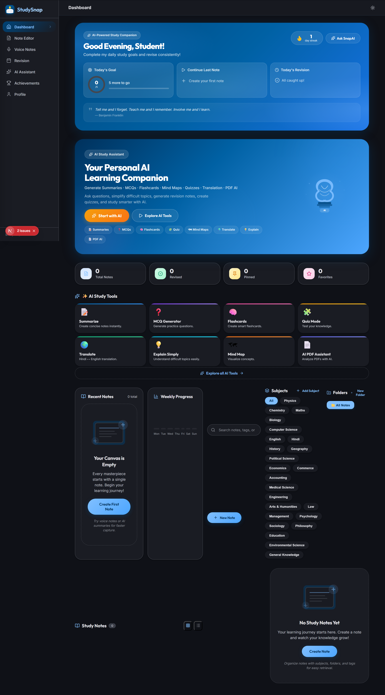

<div align="center">

# Suraj Bhan Pratap Singh

### Full Stack Developer + AI

Building production-oriented full-stack applications and practical AI-powered systems.

[GitHub](https://github.com/surajrajput999) &nbsp;•&nbsp; [LinkedIn](https://www.linkedin.com/in/suraj-bhan-pratap-singh-) &nbsp;•&nbsp; [Resume (PDF)](./public/Suraj_Bhan_Pratap_Singh_Resume.pdf)

<br />



</div>

<br />

---

### Navigation

[About](#about) • [Featured Work](#featured-work) • [Additional Work](#additional-work) • [AI Systems](#ai-systems) • [Tech Stack](#tech-stack) • [Experience](#experience) • [Certifications](#certifications) • [Education](#education) • [Portfolio Features](#portfolio-features) • [Local Development](#local-development)

---

## About

Full Stack Developer + AI focused on building production-oriented web applications, authenticated systems, payment workflows, and practical AI-powered products.

### Focus Areas
- **Full-Stack Application Architecture**: Designing maintainable, type-safe web systems across client and server tiers.
- **AI Integrations & LLM Workflows**: Integrating Groq and Google Gemini inference engines into structured user workflows.
- **Authentication & Authorization**: Implementing stateless JWT, Google OAuth, and Clerk session management.
- **Payment & Transaction Security**: Building server-authoritative checkout pipelines with Razorpay signature verification.
- **Database Engineering**: Designing schema models and caching strategies with PostgreSQL, MongoDB, and Redis.
- **Production-Oriented Engineering**: Applying disciplined input validation, rate limiting, and performance optimization.

---

## Featured Work

### 01 — StudySnap

> **AI-powered study platform focused on intelligent notes, AI-assisted learning, and structured revision workflows.**



- **Stack:** `Next.js 16` · `React 19` · `TypeScript` · `Express.js` · `PostgreSQL (Neon)` · `Drizzle ORM` · `Clerk Auth` · `Groq (LLaMA-3.1)` · `Zustand` · `Upstash Redis` · `PWA`
- **Engineering Highlights:**
  - **AI Inference Pipeline:** Integrated Groq Cloud running LLaMA-3.1 models for automatic note summarization, interactive tutoring, and MCQ quiz generation with structured output.
  - **Revision Engine:** Spaced repetition scheduling system with recall difficulty ratings (Easy, Medium, Hard) and continuous study streak tracking.
  - **Structured Note Editor:** Auto-saving rich-text editor with speech-to-text input, markdown/PDF export, and PIN-locked security for private notes.
  - **Offline Resilience:** Installable Progressive Web App (PWA) architecture with Service Worker caching.
  - **Data Layer:** Type-safe database schema modeled with Drizzle ORM and Neon Serverless PostgreSQL.

🔗 **Links:** [Live Demo](https://studysnap-sigma.vercel.app/) &nbsp;|&nbsp; [Source Code](https://github.com/surajrajput999/StudySnap)

<br />

### 02 — Cartify

> **Full-stack e-commerce platform engineered with hardened checkout, verified payments, and protected administration.**


- **Stack:** `React 19` · `Vite 8` · `Node.js` · `Express.js` · `MongoDB Atlas` · `Mongoose 9` · `Razorpay SDK` · `Google OAuth` · `Tailwind CSS 4`
- **Engineering Highlights:**
  - **Hardened Checkout Pipeline:** Server-authoritative price calculation and server-side Razorpay cryptographic signature verification preventing client-side tampering.
  - **Authentication & Access Control:** Password and OTP authentication with Google OAuth integration and JWT-based route authorization.
  - **Administrative Workflows:** Protected back-office operations for inventory management, product CRUD, and database seeding.
  - **Application Security:** Express rate limiting, Helmet HTTP security headers, CORS origin allowlists, and strict input validation schemas.
  - **Performance Optimization:** Route-level code splitting via `React.lazy` and memoized UI components for sub-second page transitions.

🔗 **Links:** [Live Demo](https://cartify-hub.vercel.app/) &nbsp;|&nbsp; [Source Code](https://github.com/surajrajput999/CARTIFY-APP)

---

## Additional Work

### Notes Nexus Labs (AI Study Buddy)

> **Generative AI utility designed for fast concept revision, lecture summarization, and on-demand flashcard generation.**

- **Stack:** `JavaScript` · `HTML5 / CSS3` · `Python (Serverless)` · `Google Gemini API` · `Vercel`
- **Key Capabilities:**
  - Integrated Google Gemini API for extracting concise, structured bullet summaries from raw study text.
  - Generates interactive, functional flashcards for targeted revision.
  - Responsive, distraction-free interface deployed serverless on Vercel.

🔗 **Links:** [Live Demo](https://notes-nexus-labs.vercel.app/) &nbsp;|&nbsp; [Source Code](https://github.com/surajrajput999/AI-Study-Buddy.git)

---

## AI Systems

Demonstrated integration of inference engines, structured prompt engineering, and emerging AI concepts connected to functional software:

- **LLM Inference Pipelines:** Groq Cloud LLaMA-3.1 integration in StudySnap for note summarization, interactive tutoring, and automated quiz generation through authenticated endpoints.
- **Generative Learning Aids:** Google Gemini API integration in Notes Nexus Labs for concept synthesis and flashcard generation.
- **Emerging & Agentic AI Concepts:** Exploration of Agentic AI, Cloud Computing, Cybersecurity, and Quantum Computing paradigms through the IBM SkillsBuild and Edunet Foundation internship program.

---

## Tech Stack

```text
Frontend               Backend                Databases & Cache      AI & Services
-------------------    -------------------    -------------------    -------------------
React 19               Node.js                PostgreSQL (Neon)      Groq (LLaMA-3.1)
Next.js 16 (App Router)Express.js             MongoDB Atlas          Google Gemini API
TypeScript             REST APIs              MySQL                  Prompt Engineering
Tailwind CSS 4         JWT Authentication     Upstash Redis          Structured Outputs
Vite 8                 Middleware Security    Drizzle ORM / Mongoose PWA / Service Workers
```

- **Authentication & Security:** Clerk, Google OAuth, JWT, Helmet, CORS, Rate Limiting, PIN Encryption
- **Payment Processing:** Razorpay SDK (Server Signature Verification)
- **Developer Tools & Infrastructure:** Git, GitHub, Vercel, Render, Postman, VS Code

---

## Experience

### Edunet Foundation
**AI & Emerging Technologies Intern** · *AICTE / IBM SkillsBuild*  
`May 2026 – June 2026` · *Jaipur / Virtual*
- Completed a 6-week internship focused on Artificial Intelligence, Agentic AI, Cloud Computing, Cybersecurity, and Quantum Computing on IBM platforms.
- Developed an industry-relevant project in AI and Cloud Computing applying emerging technology concepts to a practical use case.
- Supported by a 4-week credential in Emerging Technologies covering Agentic AI and IBM Cloud.
- [View Verified Credential (PDF)](./public/certificates/edunet-ai-internship-6-week.pdf)

### ApexPlanet Software Pvt. Ltd.
**Web Development Intern** · *Virtual Internship*  
`December 2025 – January 2026` · *Jaipur / Virtual*
- Completed a project-based internship applying HTML, CSS, and JavaScript through practical frontend development work.
- [View Verified Credential (PDF)](./public/certificates/apexplanet-web-development-internship.pdf)

---

## Certifications

- **AI Prompt Learning Journey** — Naukri Campus (2026) · [View PDF](./public/certificates/naukri-ai-prompt-learning-journey.pdf)
- **SkillQuest — Generative AI Literacy** — Simplilearn (2026) · [View PDF](./public/certificates/simplilearn-generative-ai-literacy.pdf)
- **Introduction to Cybersecurity** — Cisco Networking Academy (2024) · [View PDF](./public/certificates/cisco-introduction-to-cybersecurity.pdf)
- **Emerging Technologies Internship (4-Week)** — Edunet Foundation / IBM SkillsBuild (2026) · [View PDF](./public/certificates/edunet-emerging-technologies-4-week.pdf)

---

## Education

**B.Tech in Computer Science & Engineering**  
*Jagannath University, Jaipur, Rajasthan* · `2023 – 2027`
- Coursework: Data Structures & Algorithms, Database Management Systems, Operating Systems, Web Technologies, Software Engineering.

---

## Portfolio Features

- **Editorial Dark Interface:** Bespoke typography and design system built with Tailwind CSS.
- **Technical Case Study Modals:** In-depth architectural breakdowns with problem statements, data models, and screenshots.
- **In-App Certificate Viewer:** Verified credential modal with in-browser PDF preview and direct download.
- **Interactive Resume Hub:** Dual-mode curriculum vitae (Clean ATS formatted view + PDF document viewer).
- **Accessibility & Focus Management:** Keyboard navigation (`Tab`, `Shift+Tab`, `Enter`, `Esc`) with ARIA dialog semantics.
- **Production SEO:** Complete Open Graph, Twitter/X cards, `robots.txt`, and XML sitemap.

---

## Repository Architecture

```text
suraj-portfolio/
├── public/
│   ├── certificates/             # Verified official PDF credentials
│   ├── projects/                 # High-resolution project screenshots
│   ├── Suraj_Bhan_Pratap_Singh_Resume.pdf
│   ├── favicon.svg               # Minimal monogram favicon
│   ├── og-image.png              # 1200x630 Open Graph social share image
│   ├── robots.txt                # Search crawler indexing configuration
│   └── sitemap.xml               # Canonical XML sitemap
├── src/
│   ├── components/
│   │   ├── layout/               # Navbar, Footer
│   │   ├── sections/             # Hero, About, Projects, AI, Experience, Certs, Resume, Contact
│   │   └── ui/                   # Certificate Viewer Modal, Custom SVG Icons
│   ├── data/
│   │   ├── caseStudies.ts        # Architectural case study data models
│   │   └── portfolioData.ts      # Profile, projects, timeline, skills data
│   ├── hooks/                    # useActiveSection, useClipboard
│   ├── types/                    # TypeScript interfaces and contracts
│   ├── App.tsx                   # Main portfolio layout and modal state
│   ├── index.css                 # Design tokens and editorial CSS styling
│   └── main.tsx                  # Application entry point
├── index.html                    # Production HTML template with Open Graph SEO
├── package.json
└── tsconfig.json
```

---

## Local Development

```bash
# 1. Clone repository
git clone https://github.com/surajrajput999/suraj-portfolio.git

# 2. Navigate to project directory
cd suraj-portfolio

# 3. Install dependencies
npm install

# 4. Start local development server
npm run dev

# 5. Build for production
npm run build
```

---

<div align="center">
  <sub>Designed and built with precision by <strong>Suraj Bhan Pratap Singh</strong> · Full Stack Developer + AI</sub>
</div>
